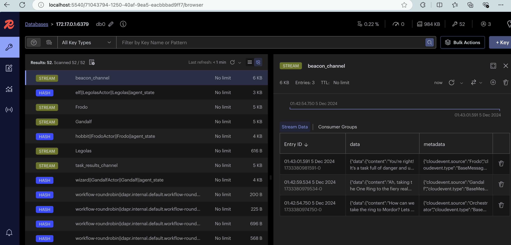

# Installation

## Install Dapr Agents

!!! info
    make sure you have Python already installed. `Python >=3.9`

### As a Python package using Pip

```bash
pip install floki-ai
```

### Remotely from GitHub

```bash
pip install git+https://github.com/dapr-sandbox/dapr-agents.git
```

### From source with `poetry`:

```bash
git clone https://github.com/dapr-sandbox/dapr-agents

cd floki

poetry install
```

## Install Dapr CLI

Install the Dapr CLI to manage Dapr-related tasks like running applications with sidecars, viewing logs, and launching the Dapr dashboard. It works seamlessly with both self-hosted and Kubernetes environments. For a complete step-by-step guide, visit the official [Dapr CLI installation page](https://docs.dapr.io/getting-started/install-dapr-cli/).

Verify the CLI is installed by restarting your terminal/command prompt and running the following:

```bash
dapr -h
```

## Initialize Dapr in Local Mode

!!! info
    Make sure you have [Docker](https://docs.docker.com/get-started/get-docker/) already installed. I use [Docker Desktop](https://www.docker.com/products/docker-desktop/).

Initialize Dapr locally to set up a self-hosted environment for development. This process fetches and installs the Dapr sidecar binaries, runs essential services as Docker containers, and prepares a default components folder for your application. For detailed steps, see the official [guide on initializing Dapr locally](https://docs.dapr.io/getting-started/install-dapr-selfhost/).


To initialize the Dapr control plane containers and create a default configuration file, run:

```bash
dapr init
```

Verify you have container instances with `daprio/dapr`, `openzipkin/zipkin`, and `redis` images running:

```bash
docker ps
```

## Enable Redis Insights

Dapr uses [Redis](https://docs.dapr.io/reference/components-reference/supported-state-stores/setup-redis/) by default for state management and pub/sub messaging, which are fundamental to Dapr Agents's agentic workflows. These capabilities enable the following:

* Viewing Pub/Sub Messages: Monitor and inspect messages exchanged between agents in event-driven workflows.
* Inspecting State Information: Access and analyze shared state data among agents.
* Debugging and Monitoring Events: Track workflow events in real time to ensure smooth operations and identify issues.

To make these insights more accessible, you can leverage Redis Insight.

```bash
docker run --rm -d --name redisinsight -p 5540:5540 redis/redisinsight:latest
```

Once running, access the Redis Insight interface at `http://localhost:5540/`

### Connection Configuration

* Port: 6379
* Host (Linux): 172.17.0.1
* Host (Windows/Mac): docker.host.internal

Redis Insight makes it easy to visualize and manage the data powering your agentic workflows, ensuring efficient debugging, monitoring, and optimization.



