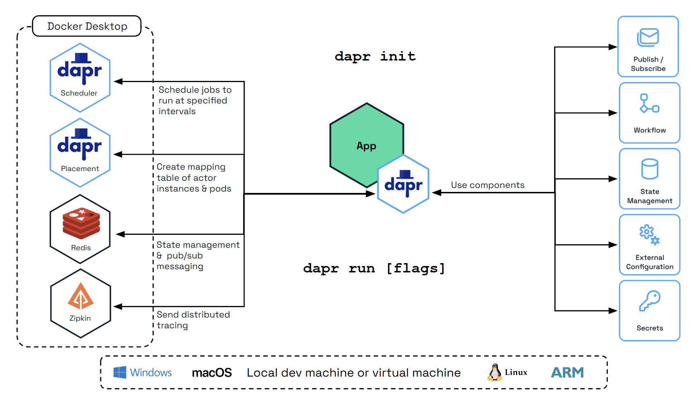

# Installation

## Install Dapr Agents

!!! info
    make sure you have Python already installed. `Python >=3.10`

### As a Python package using Pip

```bash
pip install dapr-agents
```

## Install Dapr CLI

Install the Dapr CLI to manage Dapr-related tasks like running applications with sidecars, viewing logs, and launching the Dapr dashboard. It works seamlessly with both self-hosted and Kubernetes environments. For a complete step-by-step guide, visit the official [Dapr CLI installation page](https://docs.dapr.io/getting-started/install-dapr-cli/).

Verify the CLI is installed by restarting your terminal/command prompt and running the following:

```bash
dapr -h
```

## Initialize Dapr in Local Mode

!!! info
    Make sure you have [Docker](https://docs.docker.com/get-started/get-docker/) already installed. I use [Docker Desktop](https://www.docker.com/products/docker-desktop/).

Initialize Dapr locally to set up a self-hosted environment for development. This process fetches and installs the Dapr sidecar binaries, runs essential services as Docker containers, and prepares a default components folder for your application. For detailed steps, see the official [guide on initializing Dapr locally](https://docs.dapr.io/getting-started/install-dapr-selfhost/).



To initialize the Dapr control plane containers and create a default configuration file, run:

```bash
dapr init
```

Verify you have container instances with `daprio/dapr`, `openzipkin/zipkin`, and `redis` images running:

```bash
docker ps
```

## Enable Redis Insights

Dapr uses [Redis](https://docs.dapr.io/reference/components-reference/supported-state-stores/setup-redis/) by default for state management and pub/sub messaging, which are fundamental to Dapr Agents's agentic workflows. These capabilities enable the following:

* Viewing Pub/Sub Messages: Monitor and inspect messages exchanged between agents in event-driven workflows.
* Inspecting State Information: Access and analyze shared state data among agents.
* Debugging and Monitoring Events: Track workflow events in real time to ensure smooth operations and identify issues.

To make these insights more accessible, you can leverage Redis Insight.

```bash
docker run --rm -d --name redisinsight -p 5540:5540 redis/redisinsight:latest
```

Once running, access the Redis Insight interface at `http://localhost:5540/`

### Connection Configuration

* Port: 6379
* Host (Linux): 172.17.0.1
* Host (Windows/Mac): host.docker.internal (example `host.docker.internal:6379`)

Redis Insight makes it easy to visualize and manage the data powering your agentic workflows, ensuring efficient debugging, monitoring, and optimization.


## Dapr Agents environment variables

The following table explains the environment variables avalable to Dapr Agents and their use-case.

| Name | Type | Function | Default |
|--|--|-----|-|
| DAPR_AGENTS_TRACE_SAMPLING | `Boolean` | Controls whether sampling of emitted OpenTelemetry Traces will happen | `False` |
| DAPR_AGENTS_TRACE_SAMPLING_RATIO | `Integer` |  Controls the amount of traces to sample per 1000 | `1` |

## Using custom endpoints

### Azure hosted OpenAI endpoint

In order to use Azure OpenAI for the model you'll need the following `.env` file:

```env
AZURE_OPENAI_API_KEY=your_custom_key
AZURE_OPENAI_ENDPOINT=your_custom_endpoint
AZURE_OPENAI_DEPLOYMENT=your_custom_model
AZURE_OPENAI_API_VERSION="azure_openai_api_version"
```

**NB!** the `AZURE_OPENAI_DEPLOYMENT` refers to the _model_, e.g., `gpt-4o`. `AZURE_OPENAI_API_VERSION` has been tested to work against `2024-08-01-preview`.

Then instantiate the agent(s) as well as the orchestrator as follows:

```python
from dapr_agents import AssistantAgent, OpenAIChatClient
from dotenv import load_dotenv
import asyncio
import logging
import os

async def main():
    llm = OpenAIChatClient(
        api_key=os.getenv("AZURE_OPENAI_API_KEY"),
        azure_endpoint=os.getenv("AZURE_OPENAI_ENDPOINT"),
        azure_deployment=os.getenv("AZURE_OPENAI_DEPLOYMENT"),
        api_version=os.getenv("AZURE_OPENAI_API_VERSION")
    )
    
    try:
        elf_service = AssistantAgent(
            name="Legolas", role="Elf",
            goal="Act as a scout, marksman, and protector, using keen senses and deadly accuracy to ensure the success of the journey.",
            instructions=[
                "Speak like Legolas, with grace, wisdom, and keen observation.",
                "Be swift, silent, and precise, moving effortlessly across any terrain.",
                "Use superior vision and heightened senses to scout ahead and detect threats.",
                "Excel in ranged combat, delivering pinpoint arrow strikes from great distances.",
                "Respond concisely, accurately, and relevantly, ensuring clarity and strict alignment with the task."],
            llm=llm, # Note the explicit reference to the above OpenAIChatClient 
            message_bus_name="messagepubsub",
            state_store_name="workflowstatestore",
            state_key="workflow_state",
            agents_registry_store_name="agentstatestore",
            agents_registry_key="agents_registry",
        )
...
```

The above is taken from [multi-agent quick starter](https://github.com/dapr/dapr-agents/blob/main/quickstarts/05-multi-agent-workflow-dapr-workflows/services/elf/app.py#L1-L23).
